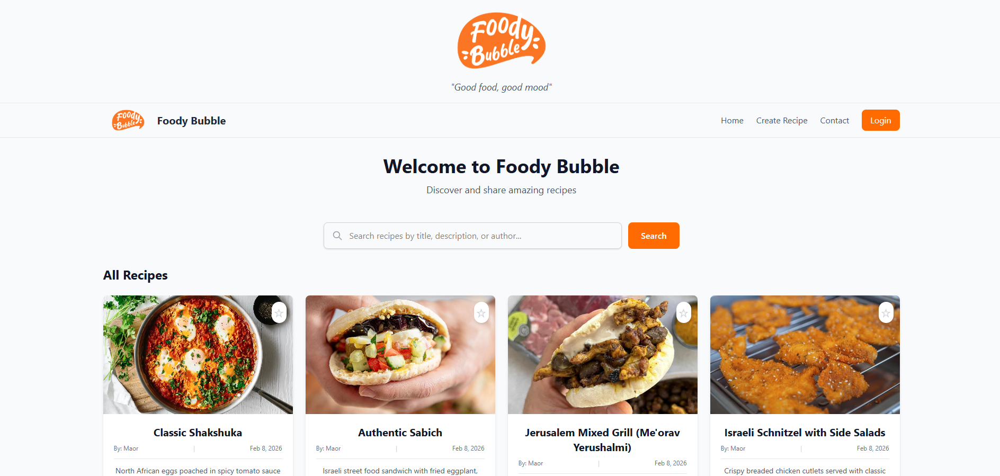
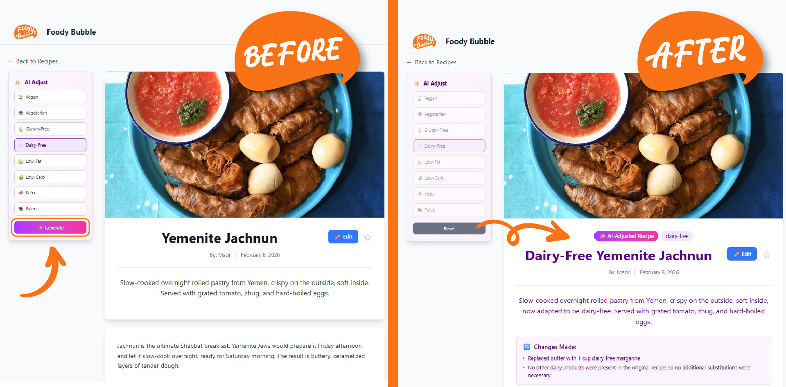
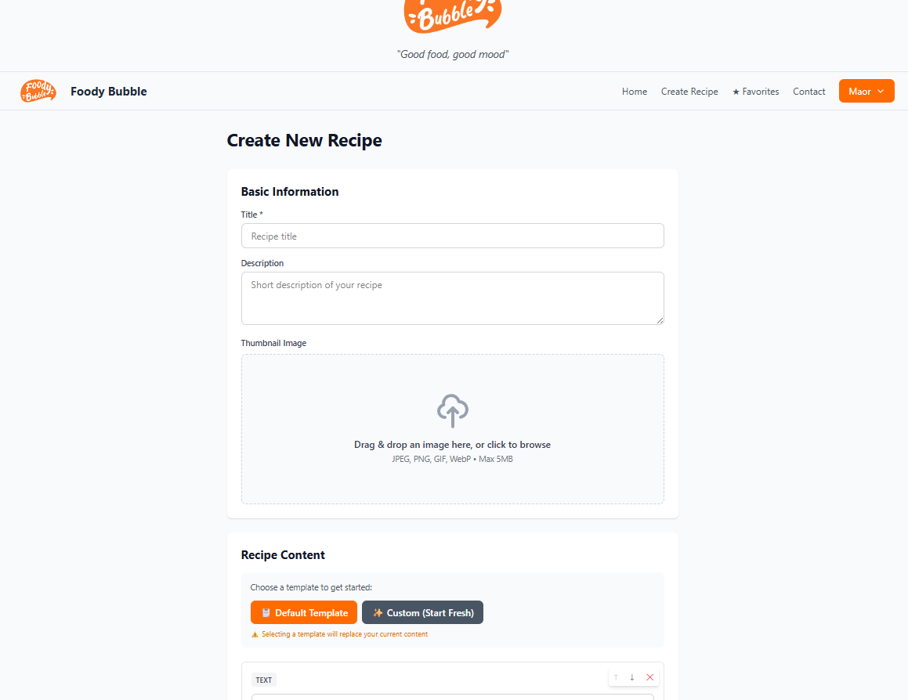
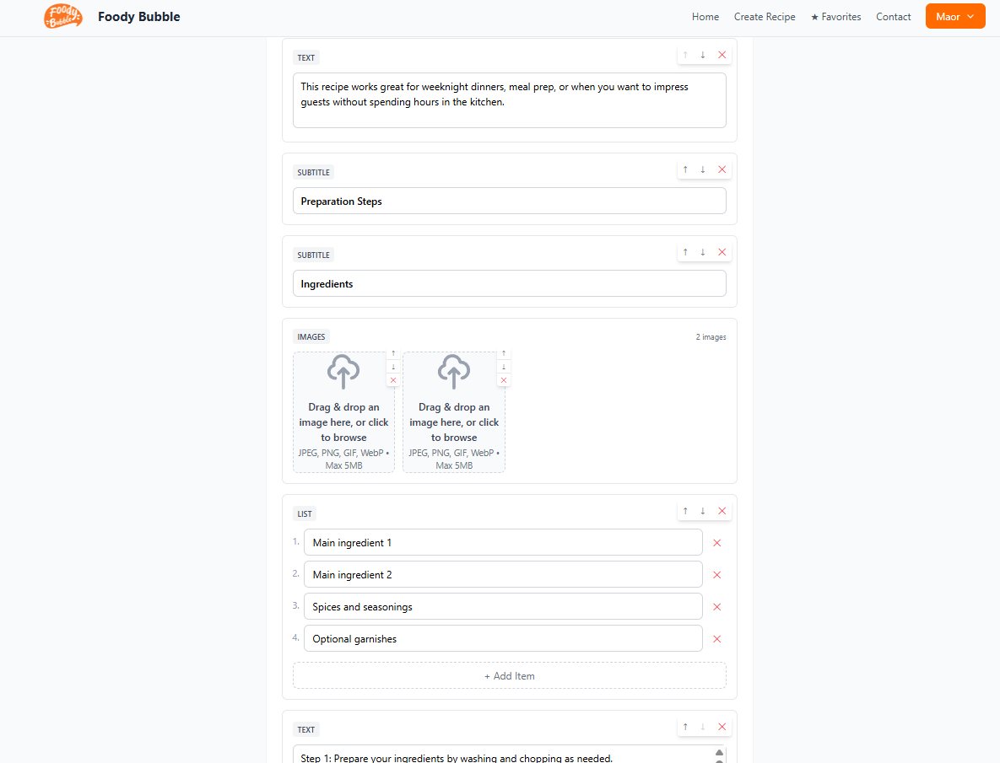

# Foody Bubble

> A full-stack recipe sharing platform with AI-powered dietary adaptations. Built with FastAPI, React 19, PostgreSQL, and Docker.

**[Live Demo](https://foodybubble.arkatony.duckdns.org/) | [Documentation](./documents/INDEX.md) | [GitHub](https://github.com/Maor-levin/recipe-app)**

---

## Why This Exists

Home cooks collect recipes from multiple platforms (Instagram, TikTok, websites) with no centralized way to organize them or adapt them for dietary needs. Manually modifying recipes often means repeatedly copying them into ChatGPT.

This platform centralizes recipe management, adds personal notes, and uses AI-powered transformations for things like vegan or gluten-free versions—backed by intelligent caching that reduces API costs by ~90%.

Built as a full-stack portfolio project showcasing production-ready architecture, scalability, and performance optimization.

---

## Technical Highlights

**Performance & Scalability:**
- **Cache-aside pattern** with normalized keys reducing AI API costs by ~90%
- PostgreSQL with JSONB for flexible data storage

**Architecture & Code Quality:**
- **Service layer pattern** separating business logic from routes
- **End-to-end type safety** using SQLModel with Pydantic validation
- **Comprehensive error handling** with structured logging (Loguru)
- **RESTful API** with 20+ endpoints and auto-generated documentation

**Key Features:**
- JWT authentication with bcrypt hashing
- AI-powered recipe variants (OpenRouter API)
- Block-based recipe editor
- Real-time search and filtering
- Image optimization via Cloudinary CDN
- Community features (comments)
- Personal organization (favorites, auto-saved notes per recipe)

---

## Tech Stack

**Backend:**  


FastAPI • PostgreSQL • SQLModel • OpenRouter AI • Cloudinary • Docker

**Frontend:**  


React 19 • Vite • Tailwind CSS • Axios • React Router

---

## Quick Start

**Prerequisites:** Docker & Docker Compose

```bash
# Clone and setup
git clone https://github.com/Maor-levin/recipe-app
cd recipe-app

# Configure environment
cp backend/env.example backend/.env
cp postgres.env.example postgres.env
# Edit both .env files:
# - backend/.env: Add API keys (Cloudinary, OpenRouter), set CORS origins, generate SECRET_KEY

# Launch
docker-compose up --build

# Access at http://localhost:5173
```

**Detailed Setup:** See [Installation Guide](./documents/INSTALL.md)

---

## Project Structure

```
backend/
├── auth/          # JWT authentication
├── services/      # Business logic (AI, caching)
├── routes/        # API endpoints
├── db/models/     # SQLModel entities
└── core/          # Configuration

frontend-v2/
├── components/    # React components (UI, modals, recipe, comments)
├── pages/         # Route pages
└── utils/         # API client, helpers
```

**Architecture Details:** See [Architecture Overview](./documents/ARCHITECTURE.md)

---

## Key Metrics

- **6 Database Tables** - Normalized schema with CASCADE relationships
- **20+ API Endpoints** - RESTful design with Pydantic validation
- **20+ React Components** - Reusable, well-structured UI
- **~5,000 Lines of Code** - Clean, maintainable, production-ready

---

## What I Learned

- Designing efficient caching strategies for external API calls
- Implementing service-layer architecture for maintainable codebases
- End-to-end type safety across database, API, and frontend
- Production considerations: logging, error handling, security best practices
- Docker orchestration for consistent development and deployment

---

## Documentation

- **[Installation Guide](./documents/INSTALL.md)** - Detailed setup instructions
- **[Architecture Overview](./documents/ARCHITECTURE.md)** - System design, database schema, and patterns
- **[API Documentation](http://localhost:8000/docs)** - Interactive API docs (FastAPI auto-generated)

---

## Screenshots

### Home Page

*Recipe feed with search and filtering*

### Recipe Detail View

*Complete recipe display with ingredients, instructions, and images*

### AI-Powered Recipe Transformation

*Generate dietary variants (vegan, gluten-free, etc.) with a single click - intelligent caching reduces repeated API calls by ~90%*

### Block-Based Recipe Editor


*Flexible JSONB-backed editor supporting multiple block types (ingredients, instructions, images, subtitles)*

### Community Features

*User comments and engagement on recipes*

---

## About

**Built by Maor Levin** | 2025

Full-stack portfolio project demonstrating modern web development practices, clean architecture, and production-ready code.

**[GitHub](https://github.com/Maor-levin/recipe-app)**

---

© 2025 Maor Levin. All Rights Reserved.
