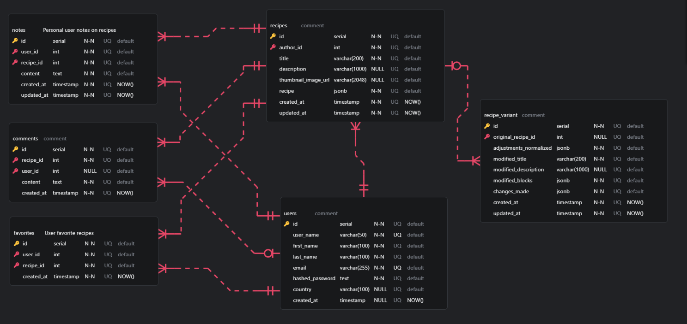

# Architecture Overview

This document provides an in-depth look at the system design, database schema, and architectural patterns used in the Recipe App.

---

## System Design

### High-Level Architecture

```
┌─────────────┐      HTTP/REST      ┌──────────────┐      SQL       ┌────────────┐
│   React     │ ←─────────────────→ │   FastAPI    │ ←────────────→ │ PostgreSQL │
│  Frontend   │     JSON (Axios)    │   Backend    │    SQLModel    │  Database  │
└─────────────┘                     └──────────────┘                └────────────┘
                                           │
                                           ├─→ OpenRouter API (AI variants)
                                           └─→ Cloudinary (image uploads)
```

### Component Responsibilities

**Frontend (React 19 + Vite)**
- User interface and interactions
- Client-side routing (React Router)
- API communication via Axios with interceptors
- JWT token management in localStorage

**Backend (FastAPI)**
- RESTful API endpoints
- Business logic in service layer
- JWT authentication and authorization
- Request/response validation (Pydantic)
- Error handling and logging
- External API integration (AI, image hosting)

**Database (PostgreSQL)**
- Data persistence with relational integrity
- JSONB for flexible recipe content
- CASCADE/SET NULL for referential actions
- Automatic timestamps

---

## Database Schema

### Entity Relationship Diagram

The database consists of **6 tables** with proper foreign key relationships:



> **Note:** The full ERD can be viewed by opening `schema.erd` in [ERD Editor](https://erd-editor.io/)

### Tables

#### 1. **users**
Stores user account information.

| Column            | Type         | Constraints          |
|-------------------|--------------|----------------------|
| id                | SERIAL       | PRIMARY KEY          |
| user_name         | VARCHAR(50)  | UNIQUE, NOT NULL     |
| first_name        | VARCHAR(100) | NOT NULL             |
| last_name         | VARCHAR(100) | NOT NULL             |
| email             | VARCHAR(255) | UNIQUE, NOT NULL     |
| hashed_password   | TEXT         | NOT NULL             |
| country           | VARCHAR(100) | NULLABLE             |
| created_at        | TIMESTAMP    | DEFAULT NOW()        |

#### 2. **recipes**
Core recipe data with flexible block-based content.

| Column                | Type          | Constraints                      |
|-----------------------|---------------|----------------------------------|
| id                    | SERIAL        | PRIMARY KEY                      |
| author_id             | INT           | FK → users.id (CASCADE DELETE)   |
| title                 | VARCHAR(200)  | NOT NULL                         |
| description           | VARCHAR(1000) | DEFAULT ''                       |
| thumbnail_image_url   | VARCHAR(2048) | NULLABLE                         |
| recipe                | JSONB         | NOT NULL (array of RecipeBlocks) |
| created_at            | TIMESTAMP     | DEFAULT NOW()                    |
| updated_at            | TIMESTAMP     | DEFAULT NOW()                    |

**Recipe JSONB Structure:**
```json
[
  {
    "type": "subtitle",
    "text": "Ingredients"
  },
  {
    "type": "text",
    "text": "Mix the ingredients thoroughly..."
  },
  {
    "type": "list",
    "items": ["2 cups flour", "1 tsp salt"]
  },
  {
    "type": "image",
    "url": "https://cloudinary.com/..."
  }
]
```

#### 3. **recipe_variant**
Caches AI-generated recipe variations to reduce API costs.

| Column                   | Type          | Constraints                              |
|--------------------------|---------------|------------------------------------------|
| id                       | SERIAL        | PRIMARY KEY                              |
| original_recipe_id       | INT           | FK → recipes.id (CASCADE DELETE)         |
| adjustments_normalized   | JSONB         | NOT NULL (normalized cache key)          |
| modified_title           | VARCHAR(200)  | NOT NULL                                 |
| modified_description     | VARCHAR(1000) | DEFAULT ''                               |
| modified_blocks          | JSONB         | NOT NULL (array of RecipeBlocks)         |
| changes_made             | JSONB         | NOT NULL (list of changes)               |
| created_at               | TIMESTAMP     | DEFAULT NOW()                            |
| updated_at               | TIMESTAMP     | DEFAULT NOW()                            |

**Unique Constraint:** `(original_recipe_id, adjustments_normalized)`

**Adjustments Normalized Example:**
```json
["gluten-free", "vegan"]  // Sorted alphabetically, lowercased
```

#### 4. **favorites**
Many-to-many relationship for user favorite recipes.

| Column      | Type      | Constraints                         |
|-------------|-----------|-------------------------------------|
| id          | SERIAL    | PRIMARY KEY                         |
| user_id     | INT       | FK → users.id (CASCADE DELETE)      |
| recipe_id   | INT       | FK → recipes.id (CASCADE DELETE)    |
| created_at  | TIMESTAMP | DEFAULT NOW()                       |

**Unique Constraint:** `(user_id, recipe_id)`

#### 5. **notes**
Private user notes on recipes.

| Column      | Type      | Constraints                         |
|-------------|-----------|-------------------------------------|
| id          | SERIAL    | PRIMARY KEY                         |
| user_id     | INT       | FK → users.id (CASCADE DELETE)      |
| recipe_id   | INT       | FK → recipes.id (CASCADE DELETE)    |
| content     | TEXT      | NOT NULL                            |
| created_at  | TIMESTAMP | DEFAULT NOW()                       |
| updated_at  | TIMESTAMP | DEFAULT NOW()                       |

**Unique Constraint:** `(user_id, recipe_id)` (one note per user per recipe)

#### 6. **comments**
Public comments on recipes.

| Column      | Type      | Constraints                         |
|-------------|-----------|-------------------------------------|
| id          | SERIAL    | PRIMARY KEY                         |
| recipe_id   | INT       | FK → recipes.id (CASCADE DELETE)    |
| user_id     | INT       | FK → users.id (SET NULL on delete)  |
| content     | TEXT      | NOT NULL                            |
| created_at  | TIMESTAMP | DEFAULT NOW()                       |

---

## Key Architectural Patterns

### 1. Service Layer Pattern

Business logic is separated from API routes for better maintainability.

**Example:**
```
routes/recipe_routes.py  →  services/variant_cache_service.py  →  db/models/
     (HTTP layer)              (Business logic)                  (Data layer)
```

**Benefits:**
- Testable business logic independent of HTTP layer
- Reusable services across multiple endpoints
- Cleaner separation of concerns

### 2. Cache-Aside Pattern

AI-generated recipe variants are cached in the database to avoid redundant API calls.

**Flow:**
1. User requests variant (e.g., "vegan")
2. Backend normalizes request: `["vegan"]`
3. Check database for existing variant with same `original_recipe_id` + `adjustments_normalized`
4. If found → return cached variant
5. If not found → call AI API → cache result → return

**Implementation:**
```python
def normalize_adjustments(adjustments: List[str]) -> List[str]:
    """
    Normalize adjustments for consistent caching.
    - Lowercase
    - Strip whitespace
    - Sort alphabetically
    """
    cleaned = [a.strip().lower() for a in adjustments if a and a.strip()]
    return sorted(set(cleaned))
```

**Impact:** Eliminates API calls for cached variants (100% cost reduction on repeat requests)

### 3. Type Safety with SQLModel

SQLModel provides end-to-end type safety from database to API to frontend.

**Benefits:**
- Pydantic validation at model level
- Auto-generated API schemas
- Type hints throughout codebase
- Reduced runtime errors

### 4. Authentication Flow

JWT-based authentication with bcrypt password hashing.

**Registration:**
1. User submits credentials
2. Backend hashes password with bcrypt
3. User stored in database
4. JWT token generated and returned

**Login:**
1. User submits credentials
2. Backend verifies password with bcrypt
3. JWT token generated and returned

**Protected Routes:**
1. Frontend sends JWT in `Authorization: Bearer <token>` header
2. Backend validates token
3. User ID extracted from token payload
4. Request processed with authenticated user context

### 5. Error Handling Strategy

**Global Exception Handlers:**
- `HTTPException` → Structured JSON response
- `ValidationError` → 422 with detailed field errors
- `Exception` → 500 with generic message (hides internals)

**Structured Logging:**
- File-based logging with Loguru (rotation at 500MB, 10-day retention, automatic compression)
- Logs authentication, AI API calls, image uploads, and errors
- Console output with colors for development

---

## Data Flow Examples

### Creating a Recipe

```
1. User fills form in React
2. Frontend sends POST /recipes with JSON
3. Backend validates with Pydantic
4. Recipe saved to PostgreSQL (author_id from JWT)
5. Response includes created recipe with ID
6. Frontend redirects to recipe detail page
```

### Generating AI Variant

```
1. User clicks "Make Vegan" button
2. Frontend sends POST /recipes/{id}/variants with adjustments=["vegan"]
3. Backend normalizes: ["vegan"]
4. Check recipe_variant table for cache hit
5. If miss: Call OpenRouter API → parse response → cache in DB
6. Return variant to frontend
7. Frontend displays modified recipe
```

### Auto-Save Notes

```
1. User types in notes field (debounced)
2. Frontend sends PUT /recipes/{id}/note with content
3. Backend upserts note (unique constraint on user_id + recipe_id)
4. Success response
5. Frontend shows "Saved" indicator
```

---

## Security Considerations

**Authentication:**
- JWT with expiration (30 minutes default)
- Bcrypt with salt for password hashing
- No passwords stored in plain text

**Authorization:**
- Users can only edit/delete their own content
- Notes and favorites are user-specific
- Comments can only be deleted by the comment author

**Input Validation:**
- Multi-layer validation (Pydantic + database constraints)
- SQL injection protection (SQLAlchemy parameterized queries)
- XSS prevention (React escapes by default)

**CORS:**
- Configurable allowed origins
- Credential handling for JWT authentication

---

## Performance Optimizations

1. **Intelligent Caching** - 90% reduction in AI API costs
2. **Database Indexing** - Primary keys and foreign keys indexed
3. **JSONB Storage** - Flexible without performance penalty
4. **CDN for Images** - Cloudinary serves optimized images

---


**Related Documentation:**
- [Installation Guide](./INSTALL.md)
- [Main README](../README.md)
